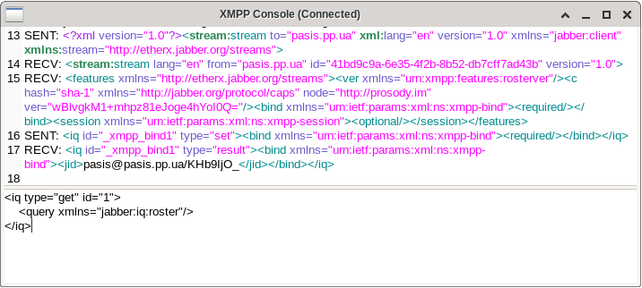
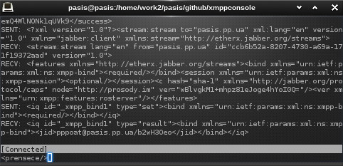

xmppconsole
===========

xmppconsole is a tool for XMPP hackers.



This tool sends raw XMPP stanzas over an XMPP connection and displays the XMPP
stream. Main purpose is to study XEPs and debug implementation of XMPP entities.

xmppconsole supports multiple UI modules: GTK, ncurses, console. Therefore, you
can use it on a server without graphical interface.

How to run xmppconsole
----------------------

The straightforward way to run xmppconsole is to provide your JID and password:
```
xmppconsole name@domain.com password
```

xmppconsole has multiple options which you can review with `--help` argument.
It allows you to connect to a server with misconfigured TLS and/or DNS record.
Also, you can connect to a server anonymously if the server supports this.
Or you can even start working with XMPP connection before authentication and
debug in-band registration or authentication mechanisms.

By default, xmppconsole detects whether it can run with graphical interface and
falls back to a text interface otherwise:



However, you can set preferable UI manually with `-u` option.

Build requirements
------------------

xmppconsole has only 1 required dependency:

* [libstrophe](https://github.com/strophe/libstrophe) version 0.10.0 or higher

You will need the following dependencies in order to build optional UI modules.

For GTK graphical interface:

* gtk-3.0
* gtksourceview (either version 3.0 or 4)

For ncurses-based text interface:

* ncurses
* readline

Supported systems: Unix-like systems (including Linux, MacOS, BSDs), Windows
with Cygwin.

Build instructions
------------------

There is no release tarballs at this point. You will have to build xmppconsole
from sources using autotools.

```
git clone https://github.com/pasis/xmppconsole.git
cd xmppconsole
./autogen.sh
./configure
make
```

Bugs
----

If you experience an issue with using xmppconsole, please, report at the
[issue tracker](https://github.com/pasis/xmppconsole/issues).

License
-------

xmppconsole is a free software and licensed under GPL3+.
